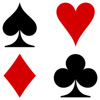

# Black Jack (21)


---

### STEP 1: The Deck

A useful strategy for representing a deck of cards is to create an array of all 52 of them.

```js
var deck = [];
for(var i=0;i<52;i++) {
  deck.push(i);
}
```

To determine the suit, use division: `Math.floor(deck[i] / 13)`. For the card's value, use modulus `deck[i] % 13`

For example, if the value in the array is the number "`32`";  `32 / 13` would be the number `2` representing the suit, considering `0` = hearts, `1` = diamonds, `2` = clubs, `3` = spades. For the card value, `32 % 13` would result in `6`. Thusly the number `32` becomes the Six of Clubs.

For your convenience, here is a function to shuffle an array:

```js
function shuffle(o){
    for(var j, x, i = o.length; i; j = Math.floor(Math.random() * i), x = o[--i], o[i] = o[j], o[j] = x);
    return o;
}
```

Since our "deck" is an array of integers, `shuffle(deck);` will shuffle the cards, and you can draw one using [`deck.pop()`](https://developer.mozilla.org/en-US/docs/Web/JavaScript/Reference/Global_Objects/Array/pop).

### STEP 2: The Table

The board consists of three decks. One for the [shoe](https://en.wikipedia.org/wiki/Shoe_(cards), containing an initial deck, one for the players hand, and one for the dealers hand.  Each of these of these can be represented using an array, as described in Step 1.

After setting up the decks, create functions for displaying them on the screen.  I strongly recommend using SVG for this.  Feel free to make use of the included [images/suits.svg](images/suits.svg) file for displaying the suits. You can copy/paste the `<path>` element to extract and position each shape, and a `<rect>` element to draw the individual cards.

### STEP 4: Game Logic

Using `deck.pop()` populate the players and the dealers hands. Then, display two buttons, "Hit" or "Stand". If the player chooses "Hit", draw another card from the deck/shoe and recalculate the value of the hand.  Continue until the total is greater than 21, in which case the player loses.

If the player hits "Stand", deal cards to the dealer, until the total of cards >= 17. Then, award points to the highest party.

### Step 5: Animate it

Add flare, using Velocity.js for transitions and HTML 5 Audio for sound effects.
