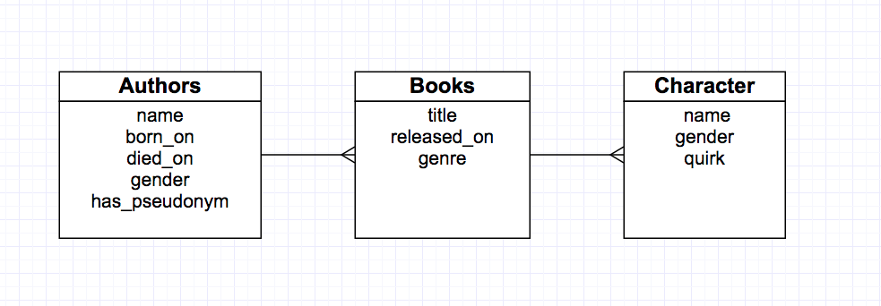

# Bookish CRUD

You've been tasked with building a three-model Rails CRUD App that allows bookish types to track their favorite authors' books and characters.

## Learning Objectives

- Practice reading ERDs
- Practice creating new rails apps from scratch
- Practice using rails generators
- Using template views using our view helpers

## Completion

Finish up to part X. More is better, healthy living is best.

## The Spec

The model specs are as follows:

An __Author__ has many books and characters (through books), as well as the following attributes:

* `name`
* `born_on`
* `died_on`
* `gender`
* `has_pseudonym` (should [default](http://guides.rubyonrails.org/active_record_migrations.html#column-modifiers) to false)

A __Book__ points back at an author, has multiple characters, and has these additional attributes:

* `title`
* `released_on`
* `genre`

A __Character__ belongs to a book, and has these additional attributes

* `name`
* `gender`
* `quirk`

Your Rails app should make use of RESTful routes, and allow you to RESTfully manage every book and character for a particular author. The RESTful actions are below:

* index
* show
* new
* create
* edit <- Will the basic info for a book or a character need updating? You make the call.
* update <- See above
* destroy

Here's a diagram of the table relationship:

This spec should help you dictate your scaffold code.

## Part 1 - Scaffold Books

Write the correct scaffold command to create your MVC for Books.

1. Generate the appropriate migration and model files, taking into account the attributes listed above
1. Run your migrations and test them in the rails console.
1. Create your models and declare their relationships
1. Test your models in the rails console
1. Build out the controllers and views, starting with 1 set of actions (for the author model), then moving on to the actions for the second model (an author's books), then moving on to the third model (managing characters in an author's book)

#### Bonus

1. Add validations to your models
1. Add the predicate methods, `pseudonym?` and `alive?` to the `Author` model
1. The client has just realized that characters can appear in many books. Change your app and schema to accomodate this.
1. Create CSS classes for each genre, so that information for horror novels appears different than information for romance novels.

#### Useful Command-Line Commands

- `rake db:create`
- `rake db:migrate`
- `rake db:seed`
- `rake db:rollback`
- `rake routes`
- `rails server` alias `rails s`
- `rails console` alias `rails c`
- `rails db`
